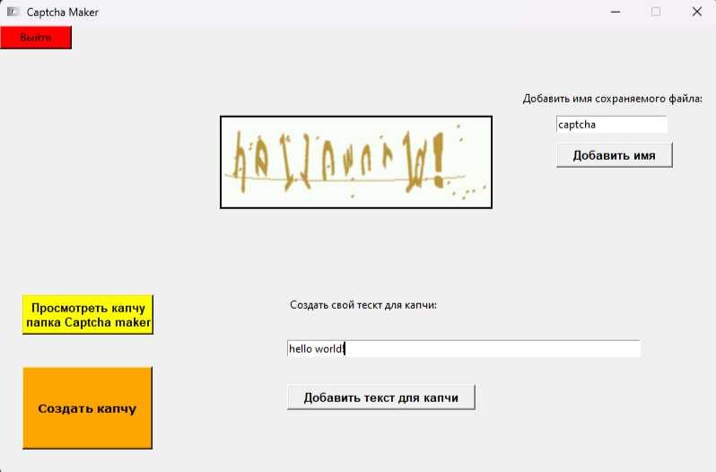

# Captcha-maker-app
Компьютерное приложение на python с помощью которого можно создать капчу. Также задать текст и название сохраняемого файла.

Требования:
1) tkinter library (pip install tkinter)
2) pillow library (pip install pillow)
3) captcha library (pip install captcha)
